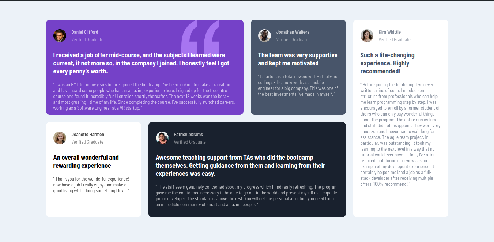

# HTML-CSS

This repo contains HTML/CSS tasks I have done.

## Assignment 1

Created a simple QR component

### Design

### My UI

## Assigment 2

Created a simple order page component

### Design

### My UI

## Assigment 3

Created a simple profile card component

### Design

### My UI

## Assignment  4

Created a drop-down component.

### Design

### My UI

## Assignment 5

Created a testimonial grid sesction.

### Design

### My UI

